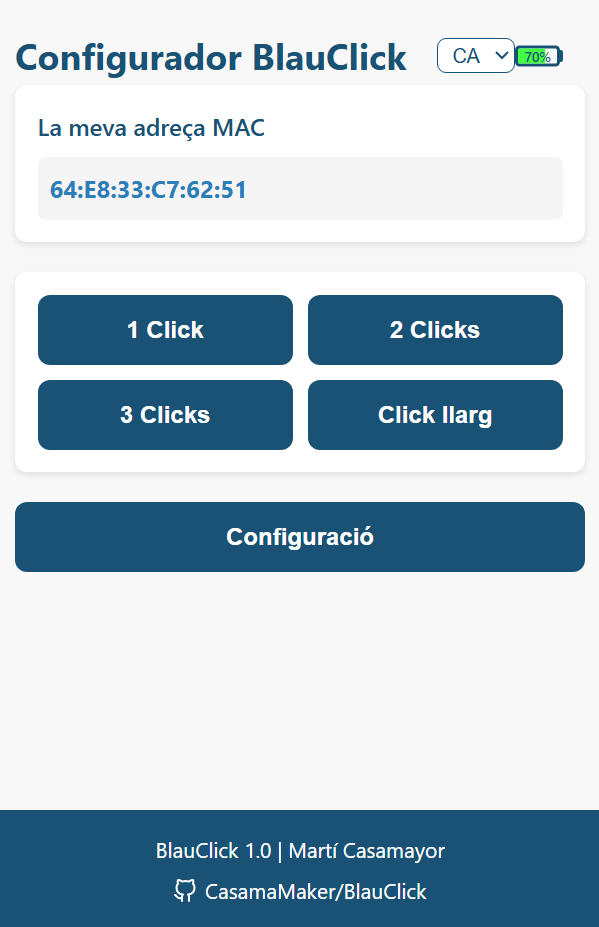
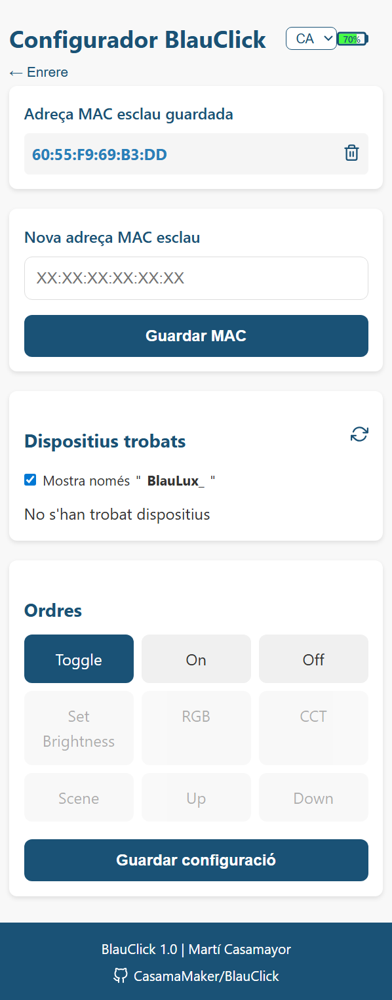
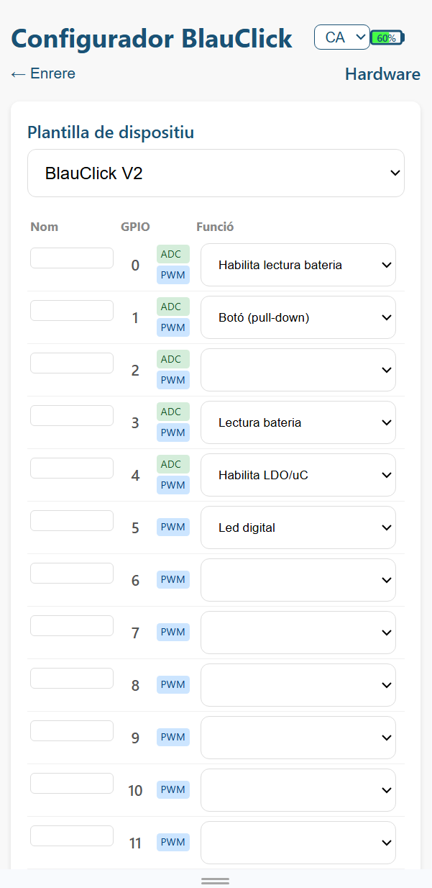
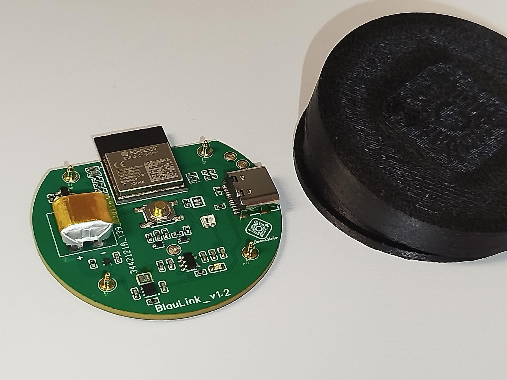

<div align="center">

# BlauClick 🔘

**Botón inteligente ESP32-C3 con batería para control de cargas inalámbrico y rápido**

[](https://github.com/CasamaMaker/BlauClick/releases)
[](https://github.com/CasamaMaker/BlauClick/releases/latest)
[](https://platformio.org/)
[](https://www.arduino.cc/)
[](https://www.espressif.com/en/products/socs/esp32-c3)
[](https://www.espressif.com/en/solutions/low-power-solutions/esp-now)
[](LICENSE.txt)

[English](README.md) |
[Català](README.cat.md) |
[Español](README.es.md)

---

*El lado **emisor** del ecosistema Blau — envía eventos de botón de forma inalámbrica a un receptor [BlauLux](https://github.com/CasamaMaker/BlauLux).*

</div>

---

[🌐 Ecosistema](#-ecosistema-blau) · [✨ Características](#-características) · [🔌 Hardware](#-hardware) · [🚀 Primeros pasos](#-primeros-pasos) · [⚙️ Configuración](#️-configuración) · [📖 Uso](#-uso) · [📡 Protocolo](#-blauprotocol) · [📁 Estructura](#-estructura-del-proyecto) · [🔧 Resolución de problemas](#-resolución-de-problemas) · [🔗 Relacionados](#-proyectos-relacionados)

---

## 🌐 Ecosistema Blau

BlauClick es el **emisor** de un sistema inalámbrico completo para controlar luces y cargas AC — sin router ni hub:

```
┌──────────────────┐    ESP-NOW (IEEE 802.11)   ┌──────────────────────┐
│     BlauClick    │ ─────────────────────────► │       BlauLux        │
│  (emisor botón)  │ ◄──────────── ACK ───────  │  (receptor de carga) │
│  Batería · ESP32 │                            │   ESP32  ·   WiFi    │
└──────────────────┘                            └──────────────────────┘
```

La comunicación es **punto a punto en la capa MAC**, sin router intermedio. La latencia es < 10 ms y el consumo de energía es mínimo. Un BlauClick puede controlar hasta **4 receptores BlauLux** simultáneamente.

---

## ✨ Características

- 🔋 **Alimentado por batería** con larga autonomía (~1 año de uso típico)
- ⚡ **Ultra-rápido** — comunicación ESP-NOW (< 10 ms de latencia)
- ✅ **Fiabilidad** — ACK por comando + hasta 3 reintentos automáticos
- 🔁 **Deduplicación** — descarta paquetes duplicados en una ventana de 2 s
- 🌐 **Configuración** — portal cautivo web, sin aplicación necesaria
- 💾 **Persistencia** — configuración guardada en NVS (sobrevive a cortes de corriente)
- 🔌 Cargador y protección de batería **integrados**
- 🖨️ Diseñado para integración fácil en carcasa imprimible en 3D
- 📡 Envía eventos de clic simple, doble, triple y pulsación larga
- 👥 **Multi-objetivo** — hasta 4 receptores BlauLux por botón
- 🖥️ **Plataformas** — ESP32-C3 · ESP32 · ESP32-S3 · ESP32-S2 · ESP32-C6
- 🔧 **Firmware** v1.0 — PlatformIO + framework Arduino

---

## 🔌 Hardware

### 📋 Plantillas de dispositivo

La interfaz web ofrece **plantillas predefinidas** para las placas compatibles:

| Plantilla | Mapeo GPIO | Notas |
|-----------|-----------|-------|
| `BlauClick V1` | EN_VBAT→4 · VBAT→3 · BTN→5 · LED_DIG→6 | PCB personalizado rev 1 |
| `BlauClick V2` | EN_VBAT→0 · VBAT→3 · BTN→1 · EN_BTN→4 · LED_DIG→5 | PCB personalizado rev 2 |
| `PICO Click` | VBAT→4 · BTN→5 · EN_BTN→3 · LED_DIG→6 | Placa proto genérica |

### 🔧 Funciones GPIO

| Función | Tipo | Descripción |
|---------|------|-------------|
| `EN_VBAT` | Salida digital | Activa el divisor de tensión de batería |
| `VBAT` | Entrada ADC | Medición de tensión de batería |
| `BTN` | Entrada digital (pull-up) | Entrada del botón, activo en LOW |
| `BTN_INV` | Entrada digital (pull-down) | Entrada del botón, activo en HIGH |
| `EN_BTN` | Salida digital | Activa el LDO / raíl de alimentación del botón |
| `LED_DIG` | Salida digital | Línea de datos NeoPixel / WS2812 |
| `LED` | Salida digital | LED simple encendido/apagado |

### 🔌 Conexiones

**BlauClick V1:**
```
GPIO 4  →  EN_VBAT (activa divisor de batería)
GPIO 3  →  VBAT    (ADC — tensión de batería)
GPIO 5  →  Botón   (pull-up, pulsado = LOW)
GPIO 6  →  NeoPixel / datos WS2812
```

**BlauClick V2:**
```
GPIO 0  →  EN_VBAT (activa divisor de batería)
GPIO 3  →  VBAT    (ADC — tensión de batería)
GPIO 1  →  Botón   (pull-up, pulsado = LOW)
GPIO 4  →  EN_BTN  (activación LDO)
GPIO 5  →  NeoPixel / datos WS2812
```

**PICO Click:**
```
GPIO 4  →  VBAT    (ADC — tensión de batería)
GPIO 5  →  Botón   (pull-up, pulsado = LOW)
GPIO 3  →  EN_BTN  (activación LDO)
GPIO 6  →  NeoPixel / datos WS2812
```

### 💾 Mapa de la flash (4 MB)

```
┌─────────────────────┐ 0x000000
│  Bootloader  ~28 kB │
├─────────────────────┤ 0x008000
│  Tabla particiones 4 kB│
├─────────────────────┤ 0x009000
│  NVS         ~20 kB │  ← configuración (WiFi, emparejamiento, config)
├─────────────────────┤ 0x00E000
│  OTA data     8 kB  │  ← registra la partición activa
├─────────────────────┤ 0x010000
│  Sketch             │
├─────────────────────┤
│  Filesystem         │
└─────────────────────┘ 0x400000  (4 MB)
```

> La zona del sistema (~200 kB) — bootloader + tabla de particiones + NVS + metadatos OTA — está reservada y no puede usarse para código ni archivos.

---

## 🚀 Primeros pasos

### 📦 Requisitos

- [PlatformIO](https://platformio.org/) (CLI o extensión de VSCode)
- Cable USB-C
- Placa ESP32-C3 (o compatible — ver plantillas)
- Driver USB-UART si es necesario (CH340, CP210x)

### 💾 Compilar y cargar

1. Clona el repositorio:
   ```bash
   git clone https://github.com/CasamaMaker/BlauClick.git
   cd BlauClick/firmware/BlauClick
   ```

2. Compila y carga el firmware:
   ```bash
   pio run -e esp32c3 -t upload
   ```

3. Carga el sistema de archivos (interfaz web):
   ```bash
   pio run -e esp32c3 -t uploadfs
   ```

4. Abre el monitor serie para verificar el arranque:
   ```bash
   pio device monitor -b 115200
   ```

**Entornos disponibles:** `esp32c3` · `esp32` · `esp32s3` · `esp32s2` · `esp32c6`

### 🔑 Configuración inicial

En el primer arranque (o tras borrar la configuración), el dispositivo no tiene ninguna MAC objetivo configurada y entra automáticamente en modo AP:

1. Enciende el BlauClick.
2. Desde tu teléfono o PC, conéctate a la red **`BlauClick_XXXX`** (últimos 4 caracteres de la MAC).
3. El portal cautivo se abre automáticamente — o navega a `http://192.168.4.1`.
4. Selecciona una plantilla de hardware (o asigna las funciones GPIO manualmente).
5. Escanea los dispositivos cercanos y selecciona la MAC objetivo de BlauLux.
6. Configura el comando a enviar al hacer clic.
7. Pulsa **Guardar**. El dispositivo reinicia y entra en funcionamiento normal.

<p align="center">
  
</p>

<p align="center">
  
  
</p>

---

## ⚙️ Configuración

### 🕐 En tiempo de compilación (`config.h`)

| Macro | Valor por defecto | Descripción |
|-------|------------------|-------------|
| `FIRMWARE_VERSION` | `"1.0"` | Cadena de versión del firmware |
| `WIFI_AP_SSID` | `"BlauClick"` | Prefijo del nombre del AP (se añade el sufijo MAC automáticamente) |
| `WIFI_AP_HOLD_MS` | `3000` | Tiempo de pulsación (ms) para entrar en modo AP de configuración |
| `WIFI_AP_TIMEOUT_MS` | `60000` | Tiempo máximo en modo AP antes de dormir (ms) |
| `BATT_MIN_MV` | `3200` | Tensión mínima de batería (mV) |
| `BATT_MAX_MV` | `4200` | Tensión máxima de batería (mV) |
| `NUM_LEDS` | `1` | Número de LEDs NeoPixel |
| `BRIGHTNESS_DEF` | `15` | Brillo de LED por defecto (0–100 %) |
| `ESPNOW_CHANNEL` | `1` | Canal WiFi para ESP-NOW |

### 🌍 En tiempo de ejecución (interfaz web)

Todos los parámetros de hardware y comportamiento se pueden cambiar desde la interfaz web (`http://192.168.4.1`):

- **Plantilla de hardware** — selecciona una configuración GPIO predefinida
- **Asignación GPIO** — asigna una función a cada pin
- **MAC objetivo** — dirección ESP-NOW del receptor BlauLux
- **Comando 1-clic** — comando y parámetros a enviar con una pulsación simple
- **WiFi STA** — conectar a la red doméstica (para OTA o MQTT futuro)

---

## 📖 Uso

### 🔘 Acciones del botón

| Acción | Resultado |
|--------|-----------|
| Pulsación simple | Envía el comando configurado (por defecto: `CMD_TOGGLE`) al objetivo |
| Pulsación doble | Envía el evento `EVT_CLICK_2` al objetivo |
| Pulsación triple | Envía el evento `EVT_CLICK_3` al objetivo |
| Pulsación larga (inicio) | Envía el evento `EVT_LONG_START` al objetivo |
| Pulsación larga (suelta) | Envía el evento `EVT_LONG_END` al objetivo |
| Mantener 3+ s | Entra en modo de configuración AP |

La ventana de detección de clic es de **400 ms** (`BLAU_CLICK_WINDOW_MS`) y el umbral de pulsación larga es de **800 ms** (`BLAU_LONG_PRESS_MS`).

### 🌐 Interfaz web

La API HTTP es accesible en `http://192.168.4.1` mientras el dispositivo está en modo AP:

| Endpoint | Método | Descripción |
|----------|--------|-------------|
| `/` | `GET` | Sirve la página web de configuración |
| `/` | `POST` | Guarda la MAC objetivo y SSID, luego duerme |
| `/mac` | `GET` | Devuelve la MAC objetivo actual |
| `/mymac` | `GET` | Devuelve la dirección MAC propia del dispositivo |
| `/macList` | `GET` | Escanea y devuelve las redes WiFi cercanas (MAC + SSID) |
| `/deletemac` | `GET` | Borra la MAC objetivo guardada |
| `/battery` | `GET` | Devuelve el nivel de batería y estado de carga (JSON) |
| `/info` | `GET` | Devuelve la versión de firmware y MAC propia (JSON) |
| `/1click_cmd` | `GET` | Devuelve el comando de 1-clic configurado (JSON) |
| `/save_1click_cmd` | `POST` | Guarda un nuevo comando de 1-clic (`cmd`, `p1`, `p2`, `p3`) |
| `/hw_gpiomap` | `GET` | Devuelve el mapeo actual de funciones GPIO (JSON) |
| `/hw_gpiomap` | `POST` | Guarda un nuevo mapeo GPIO y reinicia |
| `/hw_templates` | `GET` | Devuelve todas las plantillas de hardware predefinidas (JSON) |
| `/hw_funclist` | `GET` | Devuelve todas las funciones GPIO disponibles (JSON) |
| `/hw_gpiocaps` | `GET` | Devuelve las capacidades GPIO por perfil de MCU (JSON) |
| `/hw_clear` | `POST` | Borra la configuración de hardware y reinicia |
| `/restart` | `GET` | Reinicia el dispositivo |
| `/clearconfig` | `GET` | Borra toda la configuración (NVS) y reinicia |
| `/disconnect-ap` | `GET` | Sale del modo AP y pone el dispositivo a dormir |

---

## 📡 BlauProtocol

BlauClick utiliza **BlauProtocol v1** — un protocolo binario compacto de **10 bytes** diseñado para ESP-NOW:

```
Byte:  0      1      2      3-4        5      6    7    8    9
      [VER | TYPE | SEQ | SRC_ID(2B) | CMD | P1 | P2 | P3 | CRC8]
```

| Campo | Tamaño | Descripción |
|-------|--------|-------------|
| `VER` | 1 B | Versión del protocolo (`0x01`) |
| `TYPE` | 1 B | Tipo de mensaje (EVENT, CMD, ACK, PING…) |
| `SEQ` | 1 B | Número de secuencia circular (0–255) para deduplicación |
| `SRC_ID` | 2 B | Identificador del emisor (últimos 2 bytes de la MAC) |
| `CMD` | 1 B | Código de comando o evento |
| `P1–P3` | 3 B | Parámetros (brillo, R/G/B, WW/CW…) |
| `CRC8` | 1 B | CRC-8 (polinomio 0x07) sobre bytes 0–8 |

**Tipos de mensaje:** `TYPE_EVENT` · `TYPE_CMD` · `TYPE_ACK` · `TYPE_PING` · `TYPE_PONG` · `TYPE_STATUS_REQ` · `TYPE_STATUS_RSP`

**Eventos de botón (cmd cuando TYPE_EVENT):**

| Evento | Código | Descripción |
|--------|--------|-------------|
| `EVT_CLICK_1` | `0x11` | Clic simple |
| `EVT_CLICK_2` | `0x12` | Doble clic |
| `EVT_CLICK_3` | `0x13` | Triple clic |
| `EVT_LONG_START` | `0x21` | Inicio de pulsación larga |
| `EVT_LONG_END` | `0x22` | Suelta de pulsación larga |

**Comandos directos (cmd cuando TYPE_CMD):** `CMD_TOGGLE` · `CMD_ON` · `CMD_OFF` · `CMD_SET_BRIGHTNESS` · `CMD_SET_RGB` · `CMD_SET_CCT` · `CMD_SET_SCENE` · `CMD_DIM_UP` · `CMD_DIM_DOWN`

**Códigos ACK:** `ACK_OK` · `ACK_ERROR` · `ACK_DUPLICATE` · `ACK_UNAUTHORIZED` · `ACK_BAD_VERSION` · `ACK_BAD_CRC`

**Constantes de temporización:**

| Constante | Valor | Descripción |
|-----------|-------|-------------|
| `BLAU_ACK_TIMEOUT_MS` | 50 ms | Tiempo de espera por intento de reenvío |
| `BLAU_MAX_RETRIES` | 3 | Número máximo de reintentos sin ACK |
| `BLAU_CLICK_WINDOW_MS` | 400 ms | Ventana de detección de múltiples clics |
| `BLAU_LONG_PRESS_MS` | 800 ms | Umbral de pulsación larga |
| `BLAU_DEDUP_WINDOW_MS` | 2000 ms | Ventana de deduplicación en el receptor |
| `BLAU_MAX_SOURCES` | 8 | Máx. BlauClicks por receptor |
| `BLAU_MAX_TARGETS` | 4 | Máx. receptores por BlauClick |

Especificación completa: [`lib/BlauProtocol/blauprotocol.h`](firmware/BlauClick/lib/BlauProtocol/blauprotocol.h)

---

## 📁 Estructura del proyecto

```
BlauClick/
├── src/
│   ├── main.cpp          # Punto de entrada del firmware, setup, loop
│   ├── config.h          # Plantillas GPIO, perfiles MCU, constantes
│   ├── globals.h         # Declaraciones de variables globales
│   ├── utils.h           # Macros de utilidad y helpers
│   ├── battery.h/.cpp    # Medición de tensión de batería (ADC)
│   ├── nvs_config.h/.cpp # Persistencia NVS (Preferences)
│   ├── espnow.h/.cpp     # Inicialización ESP-NOW y callbacks
│   ├── webserver.h/.cpp  # Servidor HTTP y API REST
│   └── wifi_ap.h/.cpp    # Modo AP WiFi y portal cautivo
├── lib/
│   └── BlauProtocol/
│       ├── blauprotocol.h        # Estructura de paquetes, tipos, constantes
│       ├── blauprotocol.cpp      # CRC-8, inicialización de paquetes
│       ├── blauprotocol_link.h   # Helpers del emisor (construir, enviar, ACK)
│       └── blauprotocol_trg.h    # Helpers del receptor (parsear, dedup, ACK)
├── data/
│   ├── wifimanager.html   # Interfaz web de configuración (i18n vía JS)
│   ├── style.css          # Estilos de la interfaz web
│   └── js/                # Scripts frontend (app, gpio, api, i18n)
└── platformio.ini         # Configuración multi-objetivo de PlatformIO
```

---

## 🔧 Resolución de problemas

| Problema | Causa probable | Solución |
|----------|---------------|---------|
| Siempre entra en modo AP al arrancar | Sin MAC objetivo o plantilla GPIO configurada | Conéctate al portal y guarda la configuración |
| El portal cautivo no se abre | DNS del navegador bloqueando | Navega manualmente a `http://192.168.4.1` |
| El LED no se enciende | Plantilla GPIO no configurada | Asigna la plantilla correcta en la interfaz web |
| No se recibe ACK | Canal ESP-NOW incorrecto o receptor apagado | Verifica que `ESPNOW_CHANNEL` coincida con el receptor |
| Configuración no guardada | NVS lleno o corrupto | Llama a `/clearconfig` y reconfigura |
| Error de compilación | Biblioteca faltante | Ejecuta `pio pkg install` para descargar dependencias |
| Puerto USB no detectado | Driver faltante | Instala el driver CH340 o CP210x para tu SO |
| El dispositivo reinicia al pulsar el botón | Timeout del watchdog | Revisa el monitor serie para ver el motivo del reset |

---

## 🔗 Proyectos relacionados

- **[BlauLux](https://github.com/CasamaMaker/BlauLux)** — Controlador receptor de carga AC (dimmer, relé, NeoPixel)
- **[BlauClick](https://github.com/CasamaMaker/BlauClick)** — Botón emisor inalámbrico (complemento de BlauLux)

---

## 🤝 Contribuir

1. Haz un fork del repositorio
2. Crea una rama:
   ```bash
   git checkout -b feature/mi-feature
   ```
3. Confirma tus cambios
4. Haz push y abre un Pull Request

---

## 📜 Licencia

Licencia MIT. Consulta [`LICENSE.txt`](LICENSE.txt) para más detalles.

---

## 🙌 Agradecimientos

Inspirado en:
- [PicoClick-C3](https://github.com/makermoekoe/Picoclick-C3)
- [OBJEX_LINK](https://github.com/salvatoreraccardi/OBJEX_LINK)

---

## 📷 Foto del BlauClick



---

<div align="center">

Hecho con ❤️ por [CasamaMaker](https://github.com/CasamaMaker)

</div>
