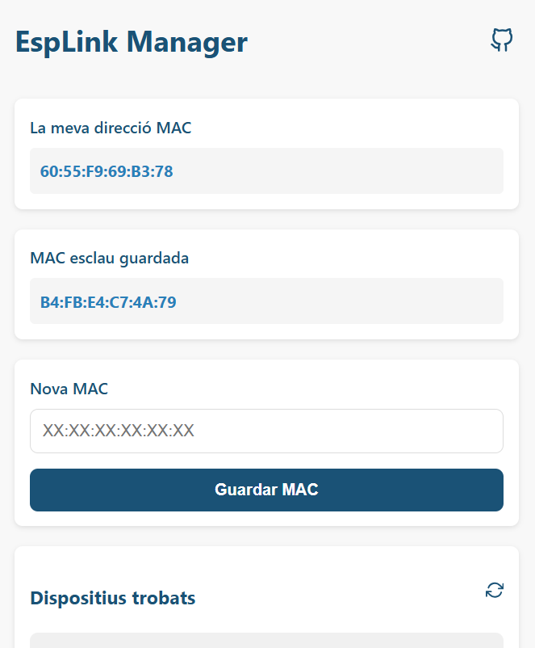
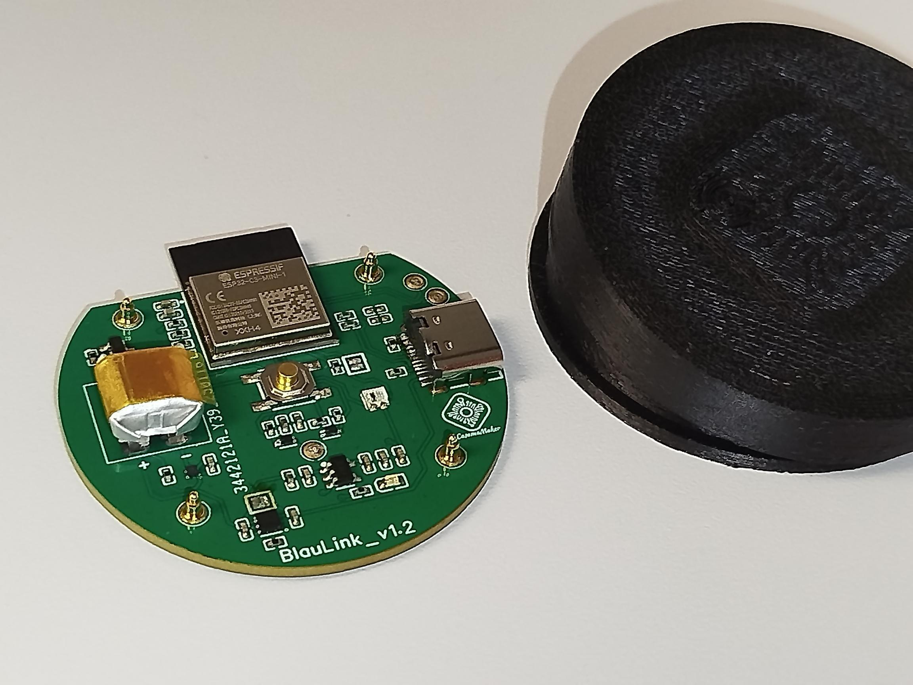

# BlauLink 🚀  
**A compact, battery-powered ESP32-C3 IoT smart button for fast, flexible control**

---

## 💡 Description

**BlauLink** is a compact IoT smart button built around the ESP32-C3 (RISC-V) designed for low-power, fast-response applications. It enables seamless control of smart devices using **ESP-NOW**, making it ideal for home automation, DIY electronics, and custom IoT ecosystems.

Unlike traditional smart switches, BlauLink focuses on **speed, simplicity, and battery efficiency**, allowing direct communication between devices without relying on a central WiFi network.

---

## ✨ Features

- 🔋 Battery-powered with long autonomy (~1 year typical usage)
- ⚡ Ultra-fast communication via **ESP-NOW**, **Wifi-AP**
- 🌐 Optional WiFi and MQTT integration (using BlauControl)
- 🔌 Integrated battery charger and protection
- 🖨️ Designed for easy 3D-printable enclosure integration
- 🧩 Simple hardware assembly
- 📡 Works as:
  - Smart home switch
  - Trigger device
- 🧠 Based on **ESP32-C3 (RISC-V)**

---

## 🛠️ Technologies

- ESP32-C3  
- ESP-NOW  
- WiFi / BLE  
- Arduino framework / PlatformIO  
- MQTT (optional)  

---

## ⚙️ Installation

### 1. Clone the repository

    git clone https://github.com/CasamaMaker/BlauLink.git
    cd BlauLink

### 2. Open the project

Use your preferred environment:
- Arduino IDE  
- PlatformIO (recommended)

### 3. Install dependencies

Ensure ESP32 board support is installed.

### 4. Flash the firmware

    pio run --target upload

---

## 🚀 Usage

### Initial Configuration

1. Press and hold the button for **~3 seconds**  
2. The LED turns **red**  
3. A WiFi AP appears:  

       EspLink-AP_xxxx

4. Connect to it  
5. Open the configuration web page  
6. Set your target device  
 
---

### Typical Use Cases

- Instant light control via ESP-NOW  
- Light Wireless control without internet/router

---

## 📦 Hardware Overview

- ESP32-C3 module  
- Push button  
- Status LED  
- Battery + charging circuit  
- Compact PCB  

---

## 🤝 Contributing

1. Fork the repository  
2. Create a branch  

       git checkout -b feature/my-feature

3. Commit changes  
4. Push and open a Pull Request  

---

## 📜 License

MIT License. See `LICENSE.txt` for details.

---

## 🙌 Acknowledgements

Inspired by:
- PicoClick-C3  
- OBJEX_LINK  

---

## 📷 Preview

